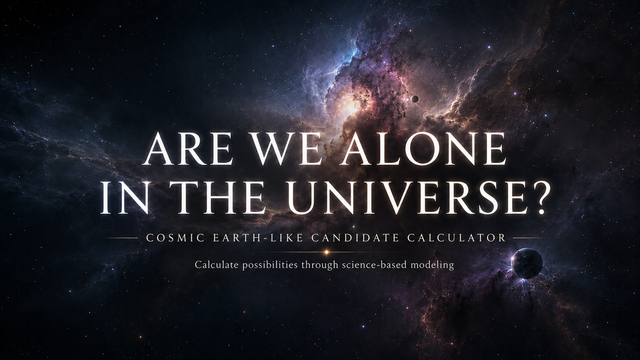

# Are We Alone in the Universe? Earth-like Planet Calculator

  

Browser-based calculator for exploring the possible number of modelled Earth-like candidates across the Milky Way and the observable universe using transparent astrophysical assumptions.

## Official website

https://www.arewealoneintheuniverse.com/

## GitHub Pages

https://jerseroman.github.io/are-we-alone-in-the-universe/

## Project status

Public review version: 2.13

## Purpose

This project is intended as a transparent, inspectable, browser-based model for exploring assumptions about modelled Earth-like candidates across the Milky Way and the observable universe.

The model focuses on planetary and astrophysical assumptions. It does not claim to prove the existence of extraterrestrial life, intelligence, technological civilizations, or detectable signals.

Its purpose is to make scale, uncertainty, and modelling assumptions visible in a structured form.

## What this project estimates

The calculator is designed to explore questions such as:

- how many modelled Earth-like candidates a selected scenario implies for the Milky Way;
- how such estimates change when astrophysical assumptions are adjusted;
- how uncertainty propagates through a simplified browser-based model;
- how estimates scale from the Milky Way to the observable universe.

The model should be interpreted as an exploratory estimation tool, not as a definitive astronomical census.

## What this project is not

This calculator is not a deterministic prediction, an observational exoplanet catalogue, or evidence for extraterrestrial life.
It is a structured modelling tool for exploring assumptions about modelled Earth-like candidates, uncertainty, and cosmic scale.

## Repository structure

- `index.html` — GitHub Pages entry point
- `CHANGELOG.md` — release history
- `src/calculator-core.js` — core calculation logic
- `src/app.js` — page initialization and UI wiring
- `src/charts.js` — chart rendering logic
- `src/share.js` — share and export behavior
- `src/accessibility.js` — accessibility support helpers
- `src/styles.css` — visual styling
- `docs/MODEL_SCOPE.md` — model scope, assumptions, and limitations
- `docs/MONTE_CARLO_METHOD.md` — Monte Carlo sampling and sampled model interval semantics
- `docs/DISTANCE_MODEL_METHOD.md` — nearest-neighbour distance model assumptions
- `docs/REUSE_AND_ATTRIBUTION.md` — reuse, fork, and attribution rules
- `.github/ISSUE_TEMPLATE/` — structured issue report templates
- `LICENSE.md` — custom source-available attribution license
- `NOTICE.md` — short attribution notice
- `CITATION.cff` — citation metadata
- `.zenodo.json` — Zenodo GitHub-release metadata
- `RELEASE_NOTES_v2.13.md` — release notes for manual GitHub release creation
- `404.html` — fallback page for GitHub Pages
- `.nojekyll` — disables Jekyll processing on GitHub Pages
- `.gitattributes` — line-ending and text-file handling rules
- `.gitignore` — ignored local/system files

## Running locally

Open `index.html` directly in a modern browser.

No installation, package manager, server, or build process is required.

Recommended browsers:

- Chrome
- Edge
- Firefox
- Safari

## Verification

Repository verification instructions are in `REPRODUCIBILITY.md`.

The v2.13 release verification status is summarized in `RELEASE_NOTES_v2.13.md`.

## GitHub Pages deployment

This repository is designed to be served directly from the repository root through GitHub Pages.

Recommended GitHub Pages settings:

- Source: Deploy from branch
- Branch: `main`
- Folder: `/ (root)`

## External dependencies

The website uses externally hosted browser assets. No vendored third-party libraries are included in this repository.

External assets used by the page may include:

- MathJax from jsDelivr for TeX and MathML rendering
- ApexCharts from jsDelivr for chart rendering
- Google Fonts for Orbitron and Nunito
- Font Awesome from cdnjs for icons
- Externally hosted project imagery from `static.wixstatic.com`, as referenced by the original page

These dependencies are loaded in the browser from their respective CDN sources.

## Source availability

This repository is source-available for transparency, inspection, citation, and review.

Source-available does not mean open source.

The project may be viewed, studied, cited, and reviewed under the conditions described in `LICENSE.md`.

Forking, redistribution, derivative use, hosted copies, and commercial use are governed by the custom license terms in `LICENSE.md`.

## Attribution

Original project by Roman Jerše:

https://www.arewealoneintheuniverse.com/

Any fork, redistribution, derivative version, public copy, or hosted version must preserve attribution to Roman Jerše and include a visible link to:

https://www.arewealoneintheuniverse.com/

See `LICENSE.md`, `NOTICE.md`, and `docs/REUSE_AND_ATTRIBUTION.md` for the full attribution and reuse conditions.

## License

This project is source-available, not open source.

Non-commercial review, inspection, citation, and limited derivative use are allowed only under the conditions stated in `LICENSE.md`.

Commercial use requires prior explicit written permission from Roman Jerše.

Do not assume that standard open-source permissions apply.

## Citation

If you cite, review, discuss, or reference this project, use the citation information provided in `CITATION.cff`.

## Zenodo Publication

Zenodo-ready metadata is provided in `.zenodo.json`. The project uses a custom source-available non-commercial attribution license, represented in Zenodo metadata with the closest controlled-vocabulary license identifier `other-nc`; the authoritative terms remain in `LICENSE.md`, `NOTICE.md`, and `docs/REUSE_AND_ATTRIBUTION.md`.

Review `.zenodo.json`, `LICENSE.md`, `NOTICE.md`, and `docs/REUSE_AND_ATTRIBUTION.md` before creating a Zenodo record or GitHub-Zenodo release archive.

## Contact

Official website:

https://www.arewealoneintheuniverse.com/
